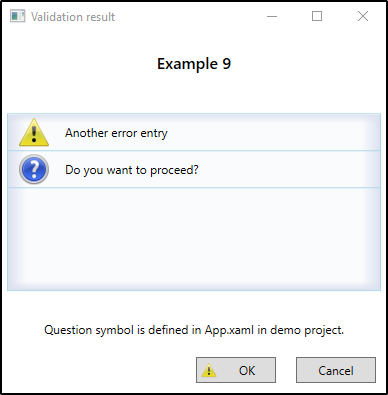

# Introduction

This library contains a WPF specific implementation of the
[IValidationSummaryPresentationService](https://github.com/ifpanalytics/Ifp.Validation/wiki/T_Ifp_Validation_IValidationSummaryPresentationService) that is defined in
the [Ifp.Validation](https://github.com/ifpanalytics/Ifp.Validation) Nuget package.

This library can display a [ValidationSummary](https://github.com/ifpanalytics/Ifp.Validation/wiki/T_Ifp_Validation_ValidationSummary) as a dialog and returns the
choice of the user (OK or Cancel):


## Change log

### Version 2.0

#### Enhancements

- [#2](https://github.com/ifpanalytics/Ifp.Validation.WPF/pull/2) Added support to copy the validation result list to the clipboard.

#### Breaking Changes

- `IValidationWPFL8nService` has new members. Any implementing classes needs to add the new members.

#### Bugfixes

### Version 1.0

Initial published version

## How to use

This library contains an implementation of the `IValidationSummaryPresentationService` interface. This interface defines methods
to show a dialog and returns the choice of the user.

```CS
// Show the ValidationSummary obtained with the help of the Ifp.Validation package.
bool ShowSummaryDialog(IValidationSummary summary)
{
    // Construct the WPF specific implementation of the IValidationSummaryPresentationService interface
    var summaryPresenter = new ValidationSummaryPresentationService(new ValidationWPFL8nService_en_US());
    return summaryPresenter.ShowValidationSummary(summary);
}
```

### Register the services for Dependency Injection

If you use a dependency injection framework you must register two services

```CS
//Simple Service to provide translated text templates.
container.RegisterService<IValidationWPFL8nService, ValidationWPFL8nService_en_US>();
//The service itself
container.RegisterService<IValidationSummaryPresentationService, ValidationSummaryPresentationService>();
```

### IValidationSummaryPresentationService.ShowValidationSummary overloads

The `ShowValidationSummary` has several overloads with the following parameters:

| Parameter                             | Description                                                                                                                                                                                                 | Default                          |
| ------------------------------------- | ----------------------------------------------------------------------------------------------------------------------------------------------------------------------------------------------------------- | -------------------------------- |
| `ValidationSummary validationSummary` | The summary to present                                                                                                                                                                                      | -                                |
| `bool showOnlyOnFailures`             | If `true` the dialog is shown only if there is at least one failure (with information, warning or error severity). Otherwise the methods returns immediately `true`. If `false` the dialog is always shown. | `false`                          |
| `string headerText`                   | Sets a custom text above the error list                                                                                                                                                                     | `null` (A default text is shown) |
| `string howToProceedMessage`          | A text shown between the error list and the buttons. Can be used to inform the user of the consequences of his choice.                                                                                      | `null`                           |

### Customizing the dialog

The dialog can be customized in three ways:

- Customizing the text
- Providing custom Severities
- Building a new dialog

#### Customizing the text

The text shown in the dialog can be changed by providing an implementation of the `IValidationWPFL8nService` interface:

```CS
public interface IValidationWPFL8nService
{
    string OK { get; }
    string Cancel { get; }
    string ValidationSuccessful { get; }
    string DialogTitle { get; }
    string Header { get; }
}
```

#### Providing custom severities

The [Ifp.Validation](https://github.com/ifpanalytics/Ifp.Validation) package allows the implementation of custom
[severities](https://github.com/ifpanalytics/Ifp.Validation/wiki/T_Ifp_Validation_ValidationSeverity) and
[outcomes](https://github.com/ifpanalytics/Ifp.Validation/wiki/T_Ifp_Validation_ValidationOutcome) like this:

```CS
public class QuestionSeverity : ValidationSeverity
{
    public static QuestionSeverity Instance = new QuestionSeverity();
    private QuestionSeverity() { }
    public override bool AllowsCancel => true;
    public override bool CausesCancel => false;
    // This number is responsible for: sort order of outcomes (descending) and the overall outcome (maximum wins).
    protected override int SeverityAsNumber => 0;
}

public class QuestionOutcome : ValidationOutcomeWithMessage
{
    public QuestionOutcome(string message) : base(message) { }
    public override ValidationSeverity Severity => QuestionSeverity.Instance;
}
```

To provide an icon for the custom severity a `DataTemplate` for the custom severity must be provided. This `DataTemplate` can
be located in the `Resource` dictionary of `App.xaml`.

```XML
<Application.Resources>
    <DataTemplate DataType="{x:Type customSeverity:QuestionSeverity}">
        <Image Source="CustomizingSeverity/question.png" Stretch="Uniform"/>
    </DataTemplate>
</Application.Resources>
```



#### Building a new dialog

TODO

## How to install

The library can be installed via Nuget [nuget.org/packages/Ifp.Validation.WPF](https://www.nuget.org/packages/Ifp.Validation.WPF/)

```CS
PS> Install-Package Ifp.Validation.WPF
```
